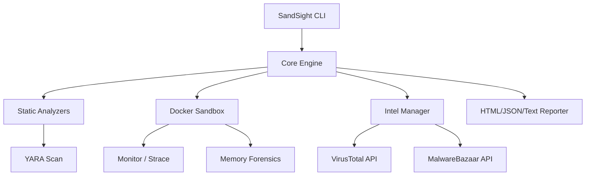

# 📡 SandSight Malware Analysis Framework

[](https://www.python.org/downloads/)
[](LICENSE)
[](Dockerfile.sandbox)
[](https://github.com/ismailtsdln/SandSight/actions)

**SandSight** is an advanced, modular, and cross-platform malware analysis engine designed for security researchers and automated threat hunting. It combines multi-format static analysis, dynamic sandbox execution, memory forensics, and threat intelligence enrichment into a single command-line ecosystem.

---

## 🚀 Key Features

### 🔍 Multi-Format Static Analysis

- **Windows (PE)**: Detailed section entropy, import/export tables, entry point detection.
- **macOS (Mach-O)**: Architecture detection and load command analysis.
- **Android (APK)**: Permission auditing, activity/service listing, and suspicious intent detection.
- **iOS (IPA)**: Metadata extraction and bundle analysis.
- **Generic**: Magic-number based file type identification.

### 🛡️ Dynamic Analysis (Sandbox)

- **Isolated Execution**: Docker-based containerization for safe execution of untrusted binaries.
- **Behavioral Tracing**: Real-time `strace` capture to monitor file access, network activity, and process spawning.
- **Network PCAP**: Background traffic capture for detailed protocol analysis in Wireshark.
- **Anti-Debugging Detection**: Automatic flagging of common evasion techniques.

### 🧠 Memory Forensics

- **Runtime Dumps**: Automatic memory capture via `gcore` before sandbox termination.
- **Pattern Matching**: Integrated YARA scanner for memory space analysis (Detecting shellcode, obfuscated strings).

### 🌐 Threat Intelligence

- **VirusTotal Integration**: Real-time reputation lookups.
- **MalwareBazaar**: Identification of known malware families and community-driven tags.

---

## 🏗️ Architecture



---

## 📦 Installation

### 1. Prerequisites

- **Python 3.11+**
- **Docker** (Required for Sandbox features)
- **YARA** (Installed via `yara-python`)

### 2. Setup

```bash
# Clone the repository
git clone https://github.com/ismailtsdln/SandSight.git
cd SandSight

# Install dependencies
pip install -r requirements.txt

# Build the Sandbox Image
docker build -t sandsight-sandbox:latest -f Dockerfile.sandbox .
```

---

## 🛠️ Usage

### Full Analysis Scan

The primary command for complete analysis including Static, Sandbox, and Intelligence.

```bash
sandsight scan suspicious_sample.exe --network --memory-dump
```

### Static Analysis Only

```bash
sandsight static sample.apk --format json
```

### Independent Sandbox Run

```bash
sandsight sandbox-run mal.elf --network
```

### Advanced Options

| Flag | Description |
| :--- | :--- |
| `--network` | Enables internet/local network access in sandbox |
| `--memory-dump` | Captures and scans process memory before exit |
| `--format` | Output report format (`text`, `json`, `html`) |
| `--output` | Path to save the final report |

---

## 🔌 Plugin System

SandSight is highly extensible. You can add custom analysis hooks in `sandsight/plugins/user/`.

```python
from sandsight.plugins.base import BasePlugin

class MyCustomPlugin(BasePlugin):
    @property
    def name(self): return "MyDetector"

    def on_static_analysis(self, file_path, results):
        # Custom logic here
        results["my_custom_flag"] = True
```

---

## ⚠️ Safety & Disclaimer
>
> [!IMPORTANT]
> **Warning**: SandSight is designed to analyze potentially destructive malware.
>
> - Always run this tool in a dedicated lab environment.
> - Do not disable Docker isolation or use `--network` on production machines when analyzing unknown samples.
> - The authors are not responsible for any damage caused by the use of this tool.

---

## 🤝 Contributing

Contributions are welcome! Please feel free to submit a Pull Request.

---

## 📜 License

This project is licensed under the MIT License - see the [LICENSE](LICENSE) file for details.

Developed with ❤️ by **Ismail Tasdelen**
